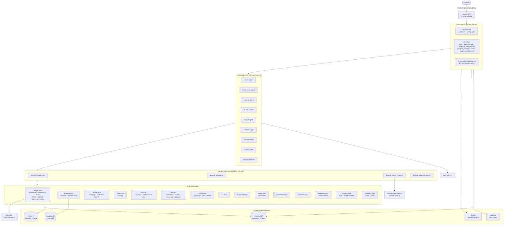
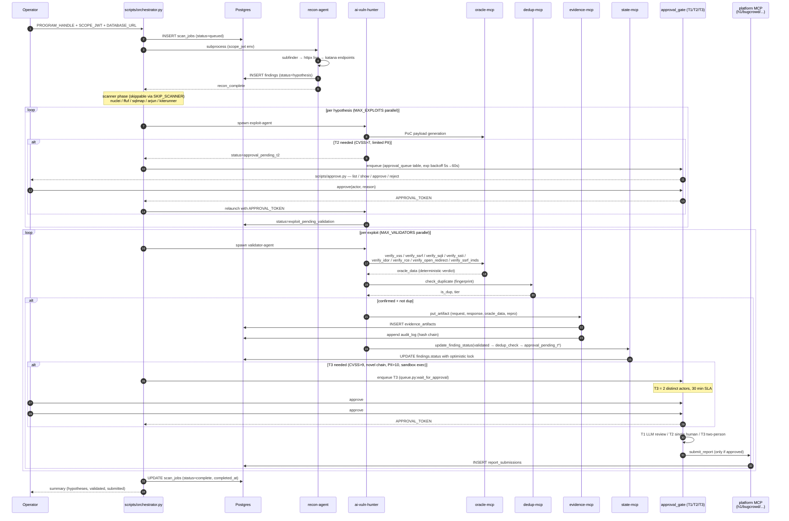
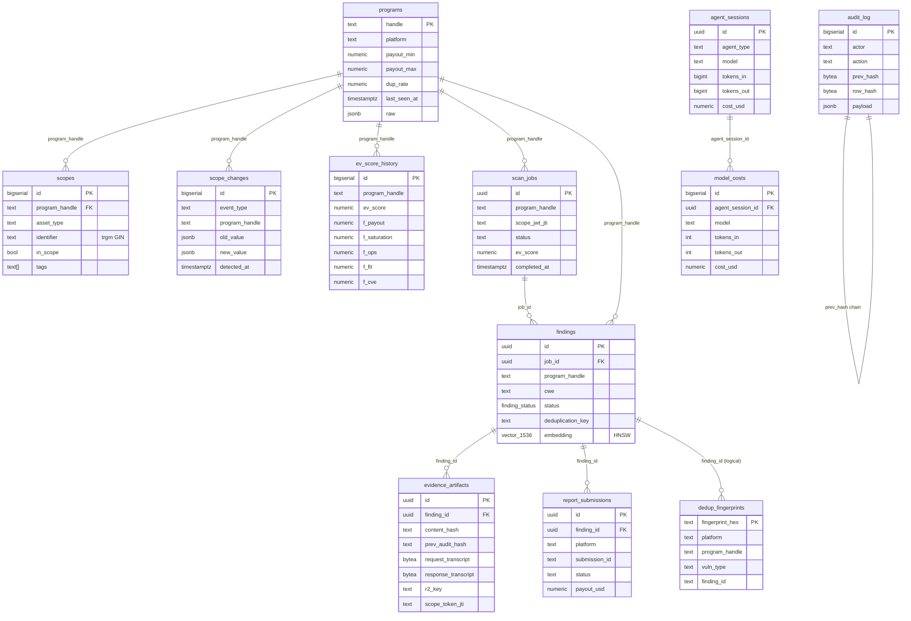
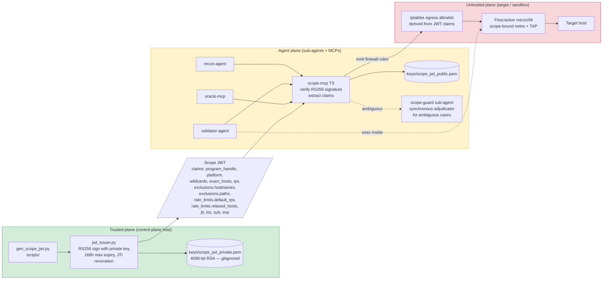
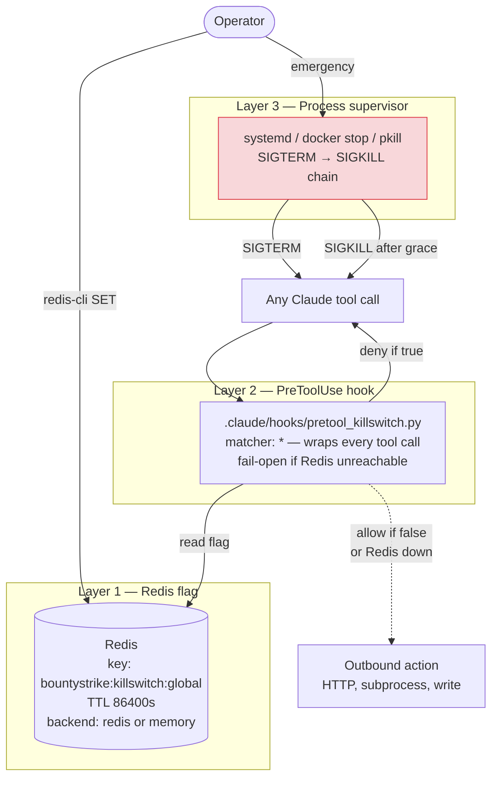
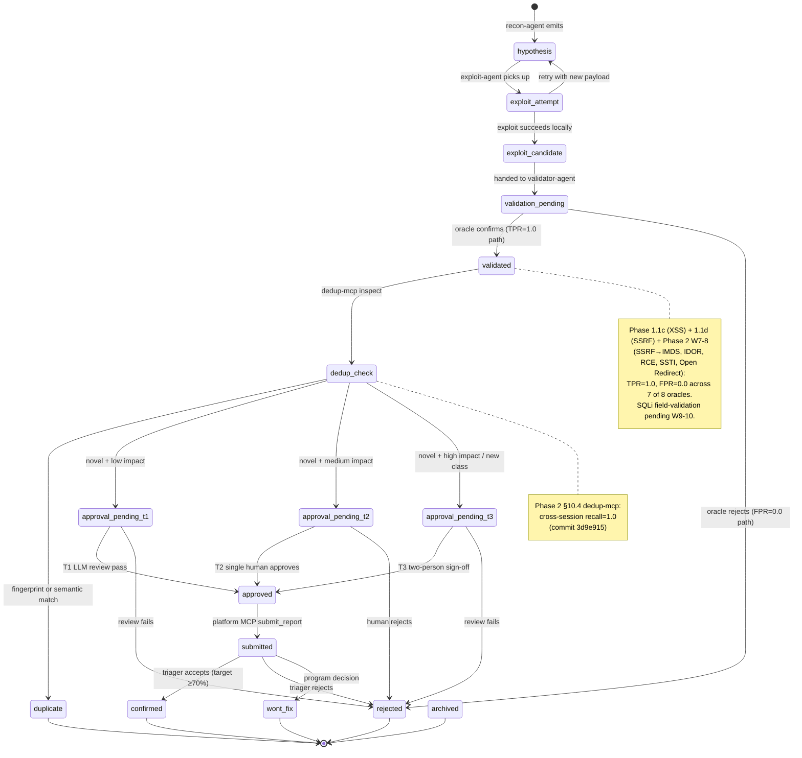

# System Architecture — BountyStrike v5

Visual reference for how BountyStrike v5 is wired together. Six Mermaid diagrams covering: component graph, end-to-end data flow, database ER, scope-JWT trust boundary, kill-switch layers, and the finding-status state machine.

Pair this with [`codebase-summary.md`](codebase-summary.md) for the file-level inventory and [`project-overview-pdr.md`](project-overview-pdr.md) for the design rationale.

**Generated:** 2026-05-01 against git HEAD `e9b4b77`. Reflects the 15 MCPs, 9 sub-agents, 4 wired PreToolUse hooks, 13 Postgres tables (12 from `01_schema.sql` + `02_dedup_fingerprints.sql`; `04_approval_queue.sql` adds `approval_queue` and `05_findings_raw_finding.sql` adds the `raw_finding` JSONB column), and the 8 oracles in `oracle-mcp` that exist on disk today. Phase 2 W7-8 sprint closed: 5 new field-validation suites (SSRF→IMDS, IDOR, RCE, SSTI, Open Redirect) pass at TPR=1.0/FPR=0.0, and T3 approval plumbing is wired in `scripts/orchestrator.py`.

## 1. Component Graph

The control plane orchestrates a fleet of Claude sub-agents. Sub-agents reach into MCP servers (stdio FastMCP) for any side-effecting work. Postgres is the single authoritative store; Redis is a kill-switch flag and approval cache; Cloudflare R2 (or local FS) holds blob evidence; OAST callbacks land at Interactsh.

## 2. End-to-End Data Flow

A single scan of one bounty program. `scripts/orchestrator.py` is the entry point; everything else fans out from there.

## 3. Database ER

The 12 Postgres tables (11 in `infra/sql/01_schema.sql` + `dedup_fingerprints` from `02_dedup_fingerprints.sql`). Foreign keys shown; indexes/ENUMs noted in [`codebase-summary.md`](codebase-summary.md) §Tables.

## 4. Scope-JWT Trust Boundary

The first non-negotiable: scope is enforced at the network layer, not the prompt. The control plane signs an RS256 4096-bit JWT; every MCP that touches a target validates it against the public key; the Firecracker VM (Phase 2+) runs an iptables egress allowlist derived from the JWT claims.

## 5. Kill-Switch Layers

Three independent enforcement paths so any one of them being down is not catastrophic.

**Properties:**
- **L1 instant** (~10 ms): operator runs `redis-cli -a $REDIS_PASSWORD SET bountystrike:killswitch:global 1 EX 86400`.
- **L2 enforces** on every tool invocation via the wired PreToolUse hook (`.claude/settings.json`).
- **L3 backstop**: if the agent runtime ignores the hook (bug or compromise), the supervisor terminates the process tree.
- **Fail-open at L2**: if Redis is unreachable, the hook allows the call (so a Redis outage doesn't halt every scan), and L3 remains as the backstop.

## 6. Finding Status State Machine

The `finding_status` ENUM has 16 states from `infra/sql/01_schema.sql`. State transitions are gated by approval-tier hooks and oracle verdicts.

## Component-to-File Cross-Reference

For each component above, the canonical source location:

| Component | File |
|---|---|
| Orchestrator entry | [`scripts/orchestrator.py`](../scripts/orchestrator.py) |
| Scope JWT issuance | [`control-plane/src/control_plane/domains/scope_management/services/jwt_issuer.py`](../control-plane/src/control_plane/domains/scope_management/services/jwt_issuer.py) |
| Scope JWT validation | [`mcp/scope-mcp/src/jwt.ts`](../mcp/scope-mcp/src/jwt.ts), [`mcp/scope-mcp/src/scope.ts`](../mcp/scope-mcp/src/scope.ts) |
| Approval gate logic | [`control-plane/src/control_plane/domains/approval_gate/services.py`](../control-plane/src/control_plane/domains/approval_gate/services.py) |
| Approval queue mechanics | [`control-plane/src/control_plane/domains/approval_gate/queue.py`](../control-plane/src/control_plane/domains/approval_gate/queue.py) — `enqueue / approve / reject / wait_for_approval` (exp backoff 5s→60s) |
| Operator approval CLI | [`scripts/approve.py`](../scripts/approve.py) — `list / show / approve / reject` subcommands |
| Approval queue migration | [`infra/sql/04_approval_queue.sql`](../infra/sql/04_approval_queue.sql) |
| `findings.raw_finding` migration | [`infra/sql/05_findings_raw_finding.sql`](../infra/sql/05_findings_raw_finding.sql) |
| EV scoring | [`control-plane/src/control_plane/domains/program_ranking/services/scoring_service.py`](../control-plane/src/control_plane/domains/program_ranking/services/scoring_service.py) |
| Recon service | [`control-plane/src/control_plane/domains/recon/service.py`](../control-plane/src/control_plane/domains/recon/service.py) |
| Postgres schema | [`infra/sql/01_schema.sql`](../infra/sql/01_schema.sql) |
| Dedup migration | [`infra/sql/02_dedup_fingerprints.sql`](../infra/sql/02_dedup_fingerprints.sql) |
| Audit realign migration | [`infra/sql/03_audit_log_realign.sql`](../infra/sql/03_audit_log_realign.sql) |
| Docker stack | [`infra/docker/docker-compose.yml`](../infra/docker/docker-compose.yml) |
| Kill-switch hook | [`.claude/hooks/pretool_killswitch.py`](../.claude/hooks/pretool_killswitch.py) |
| Antislop hook | [`.claude/hooks/pretool_antislop.py`](../.claude/hooks/pretool_antislop.py) |
| Approval-gate hook | [`.claude/hooks/pretool_approval_gate.py`](../.claude/hooks/pretool_approval_gate.py) |
| OpenRouter routing hook | [`.claude/hooks/pretool_venice_route.py`](../.claude/hooks/pretool_venice_route.py) |
| Hook wiring | [`.claude/settings.json`](../.claude/settings.json) |
| Sub-agent specs | [`.claude/agents/`](../.claude/agents/) |

## See Also

- [`project-overview-pdr.md`](project-overview-pdr.md) — design rationale + non-negotiables
- [`codebase-summary.md`](codebase-summary.md) — file inventory + dependency table + table list
- [`code-standards.md`](code-standards.md) — DDD layout + how to add a new MCP / hook / agent
- [`research/02-routing-ev.md`](research/02-routing-ev.md) — EV formula, model routing matrix, scope JWT scheme
- [`research/03-verifier-antislop.md`](research/03-verifier-antislop.md) — oracle designs + AnyPoC reward-hack countermeasures
- [`research/04-skills-mcps.md`](research/04-skills-mcps.md) — hook lifecycle + MCP catalogue
- [`research/05-deployment.md`](research/05-deployment.md) — solo + SaaS deployment walk-through
